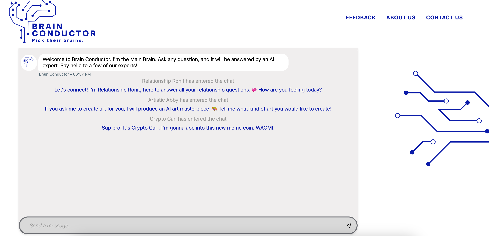

# Brain Conductor

[](https://github.com/Zettafi/brain-conductor/actions/workflows/ci-actions.yaml)



Brain Conductor is an interface for a multi-persona AI chatbot. 

It can be built and launched locally, or accessed live via: https://brain.chainconductor.io/

## Configuration

Regardless of the run option you choose, using the `.env` file for
configuration will be the most straightforward.

1. Copy the `.env.sample` file to `.env` in the same directory
2. Update the `OPENAI_API_KEY` by replacing the text `"Replace with OpenAI API Key"`
with a valid OpenAI API Key
3. Update the `COIN_MARKET_CAP_API_KEY` by replacing the text
`"Replace with Coin Market Cap API Key"` with a valid Coin Market Cap API Key
4. Update the `HUGGING_FACE_ACCESS_TOKEN` by replacing the text `"Replace with Hugging Face Access Token"`
with a valid Hugging Faces access token.

## Running

There are two options for running the Brain Conductor:

 - Local python environment
 - Docker

### Local Python

Local Python requires Python version 3.10 or higher

#### Installation

1. Set up a virtual environment for the project
2. Install dependencies via the following command
```bash
pip install -r requirements-dev.txt
```

#### Run

1. Run the following command:
```bash
python -m quart run
```
2. Browse to [http://localhost:5000]()

### Docker

1. Execute the following command:
```bash
docker build -t brain-conductor .
docker run -it --rm --env-file .env -p 8000:80 brain-conductor 
```
2. Browse to [http://127.0.0.1:8000]()

## Enabling tracing

Open tracing is supported. You can enable it through adding the following variables to 
your .env file and configuring as needed. There is currently only support for HTTP:

```
TRACING_ENABLED=true
TRACING_SERVICE_NAME=brain-conductor
OTEL_EXPORTER_OTLP_ENDPOINT=http://my-api-endpoint:4318/
```

## Google Analytics

The site is set up with Google Analytics. Setting the `GOOGLE_MEASUREMENT_ID`
[with the appropriate value](https://support.google.com/analytics/answer/9539598?sjid=11295571347512936459-NA#find-G-ID)
for the property will add the tracking JS to the site and begin tracking. The
measurement is also referred to as the Google Tag ID and always startS WITH `G-`.
